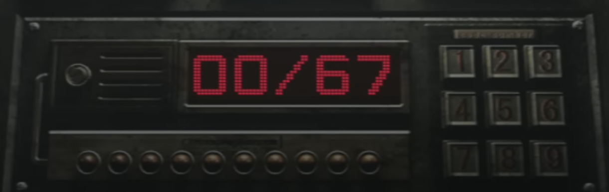
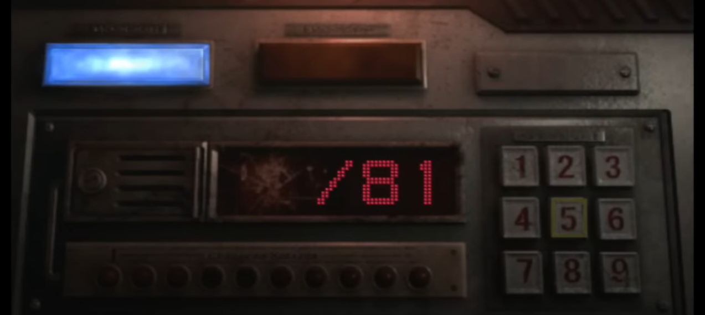

# kata-train-countdown

 **Kata 31 per l'especialitat fullstackPHP 14-3-24**

Viatgem en un tren en marxa, en flames i, possiblement, ple de zombies. Hem de frenar-lo com sigui. Per això, necessitem activar el fre d'emergència.  Per a fer-ho tenim això:

- Un teclat de 9 digits.
- 10 digits a entrar.
- L'objectiu per activar el fre és que, la suma dels 10 digits que introduim sumi tant com el nombre reflexat a la foto(67).
- Cada cop que introduim un nombre, ens mostrar la suma parcial.

Però, això no és tot! Tenim un segon codi a desbloquejar!

Funciona igual però...

- Varia el nombre objectiu a obtenir.
- No es mostra la suma parcial!

**Bonus Track:** Posa un compte enrere de 30" per a conseguir els objectius! (VERY HARD!)